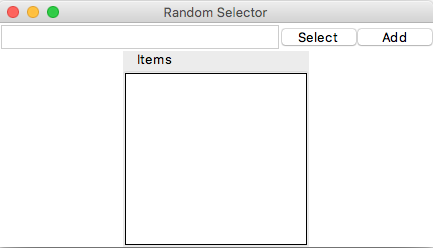

# tkouter

在過往的 GUI 程式設計中，製作 layout 往往是一件麻煩事。

1. 散落各處的元件及其擺放方式，難以讓設計師一目了然地想像和理解排版，我們只能透過實際運行 GUI 應用才能觀察到整體的佈局設計。
2. 其次，在代碼中，關於佈局的 **視圖邏輯**、處理使用者輸入與渲染的 **控制邏輯** 與 GUI 應用主要的 **計算邏輯**，完全混雜在一起，既不利於開發，也不利於維護修改。
3. 其三，缺乏統一性的方式可以對相關 GUI 元件進行屬性上的修改。

以上這些不足，在 Web 開發中，基於歷史發展的硬限制和逐步的改良加強，早就有了更方便的工具和解決方法: html、css 和模板語言的使用，能夠完全地切割視圖邏輯，能使設計單純化，也能使佈局一目了然；使用 MVC 設計架構的框架，能夠切割各種邏輯業務，使得設計更有彈性、更易維護。

基於以上需求和 Web 解決方案的啟發，tkinter 的擴充函式庫 - tkouter 誕生了，它支援使用者以 html 進行 layout 的設計。自此將視圖切割，並大幅度地簡化了設計的難度，更能以此為基礎，讓整體的設計趨近於 MVC 的原則。

## Contents

* [安裝](#安裝)
* [需求](#需求)
* [入門](#入門)

## 安裝

使用 `pip` 安裝是最方便的：

```sh
$ pip install tkouter
```

或也可以直接複製本專案：

```sh
$ git clone https://github.com/dokelung/tkouter.git
```

## 需求

* Python3.5 或更新的版本
* [Jinja2](http://jinja.pocoo.org/docs/2.10/)

## 入門

我們將會使用 [專案範例](demo) 中的 [隨機選擇器](demo/randsel) 來作為我們的第一個使用範例。這個隨機選擇器可以讓使用者自訂多個選擇項目，並且從中做出一個隨機的選擇。

P.S. 範例是什麼並不重要，重要的是了解 tkouter 的使用概念。

### 第一步：使用 html 來佈局視窗程式

一個基本的 tkouter 元件需要使用一個對應的 html 文件來描述佈局(layout)，下面是初始版本的佈局 html 及其對應的說明與實際視圖：

```html
<html>
    <head>
        <title> Random Selector </title>
    </head>
    <body>
        <left>
            <entry width="30" />
            <button width="8" text="Select" />
            <button width="8" text="Add" />
        </left>
        <top type="labelframe" text="Items">
            <listbox />
        </top>
    </body>
</html>
```

* 如同標準的 html 文件，我們在最外層要使用成對的 `<html>` 標籤夾住整份文件。
* `<html>` 其下分別有成對的 `<head>` 標籤和 `<body>` 標籤。
  * `<head>` 標籤用來設定一些 tkouter 的上層資訊，像是視窗名稱、選單資訊等。
  * `<body>` 標籤用來佈局實際使用到的元件。
* `<title>` 標籤用來設定視窗的名稱，但要注意，若這個 tkouter 的 master(parent/root) 不是 `TK` 的話，是不允許使用 `<title>` 的。
* tkouter 一共提供四種需成對 `pack` 用的 **佈局標籤**，分別是 `<top>`, `<bottom>`, `<left>` 和 `<right>`，這四個標籤會產生 `Frame` 元件來佈局其下的元件。
  * `<top>`：其下的元件會由上至下擺置。
  * `<bottom>`：其下的元件會由下至上擺置。
  * `<left>`：其下的元件會由左至右擺置。
  * `<right>`：其下的元件會由右至左擺置。
* 所有的 **元件標籤** 都支援非成對模式。而對於有 `text` 屬性的元件，tkouter 也支援成對的標籤，標籤中夾住的文字將會變成元件的 text 值。但在這個範例中，我們都使用顯性的 html 屬性 `text` 來設定元件的文字。
  * `<entry>`：會產生一個 `Entry` 元件，在這個例子中我們用 html 的標籤屬性 `width="30"` 來將該元件的長度設定為 30。
  * `<button>`：會產生一個 `Button` 元件，我們在此一樣透過屬性設定其寬度與文字。
  * `<listbox>`：會產生一個 `ListBox` 元件。


